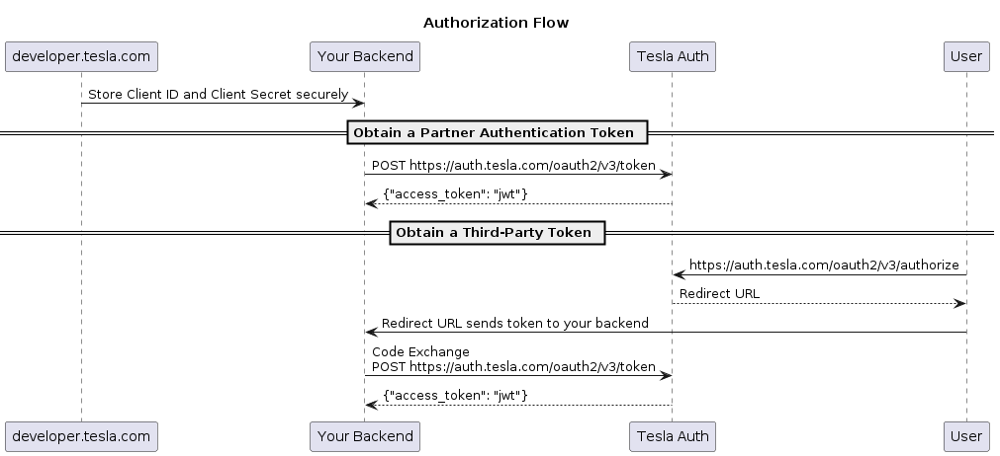
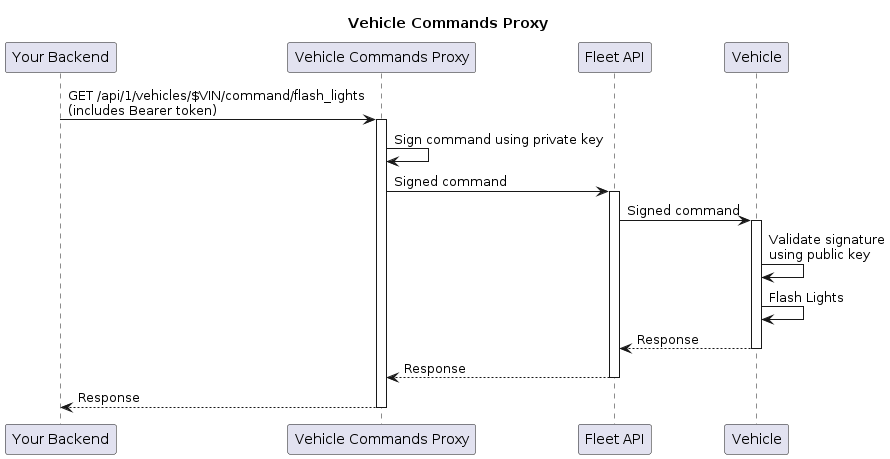

# Tesla Vehicle Command SDK
[](https://pkg.go.dev/github.com/teslamotors/vehicle-command/pkg)
[](https://github.com/teslamotors/vehicle-command/actions/workflows/build.yml)
[](https://github.com/teslamotors/vehicle-command/tags)
[](https://hub.docker.com/r/tesla/vehicle-command/tags)


Tesla vehicles now support a protocol that provides end-to-end command
authentication. This Golang package uses the new protocol to control vehicle
functions, such as climate control and charging.

Among the included tools is an HTTP proxy server that converts REST API calls
to the new vehicle-command protocol.

Some developers may be familiar with Tesla's Owner API. Owner API will stop
working as vehicles begin requiring end-to-end command authentication. If you
are one of these developers, you can set up the proxy server or refactor your
application to use this library directly. Pre-2021 Model S and X vehicles do
not support this new protocol. [Fleet
API](https://developer.tesla.com/docs/fleet-api/getting-started/what-is-fleet-api) will continue
to work on these vehicles.

## System overview

Command authentication takes place in two steps:

 1. Tesla's servers will only forward messages to a vehicle if the client has a
    valid [OAuth token](https://oauth.net/2/).
 2. The vehicle will only execute the command if it can be authenticated using a
    public key from the vehicle's keychain.

So in order to send a command to a vehicle, a third-party application must
obtain a valid OAuth token from the user, and the user must enroll the
application's public key in the vehicle.

Tesla's website has [instructions for obtaining OAuth
tokens](https://developer.tesla.com/docs/fleet-api/authentication/third-party-tokens). This README has
instructions for generating private keys and directing the user to the
public-key enrollment flow. The tools in this repository can use the OAuth
token and the private key to send commands to vehicles.

For example, the repository includes a [command-line interface](cmd/tesla-control/README.md):

```bash
tesla-control -ble -key-file private_key.pem lock
```

And a REST API proxy server (which is provided with a private key on launch and
uses OAuth tokens sent by clients):

```
curl --cacert cert.pem \
    --header 'Content-Type: application/json' \
    --header "Authorization: Bearer $TESLA_AUTH_TOKEN" \
    --data '{}' \
    "https://localhost:4443/api/1/vehicles/$VIN/command/door_lock"
```

## Installation and configuration

### Installing locally

Requirements:

 * You've [installed Golang](https://go.dev/doc/install). The package was
   tested with Go 1.23.0.
 * You're using macOS or Linux. (Everything except BLE should run on Windows,
   but Windows is not officially supported).

Installation steps:

 1. Download dependencies: `go get ./...`
 1. Compile tools and examples: `go build ./...`
 1. Install tools to your PATH: `go install ./...`

The final command installs the following utilities:

 * **tesla-keygen**: Generate a command-authentication private key and
   save it to your system keyring.
 * **tesla-control**: Send commands to a vehicle over BLE or the Internet. See
   [tool's README file](cmd/tesla-control/README.md) for more information.
 * **tesla-http-proxy**: An HTTP proxy that exposes a REST API for sending
   vehicle commands.
 * **tesla-auth-token**: Write an OAuth token to your system keyring. This
   utility does not fetch tokens. Read the [Fleet API documentation](https://developer.tesla.com/docs/fleet-api/authentication/third-party-tokens)
   for information on fetching OAuth tokens.

### Installing with Docker

A Docker image is available for running these tools. The image defaults to
running the HTTP proxy, but the `--entrypoint` flag changes the tool to be used.

Run the image from Docker hub:

```bash
docker pull tesla/vehicle-command:latest
docker run tesla/vehicle-command:latest --help

# running a different tool
docker run --entrypoint tesla-control tesla/vehicle-command:latest --help
```

An example [docker-compose.yml](./docker-compose.yml) file is also provided.

```bash
docker compose up
```

### Configuration

The following environment variables can used in lieu of command-line flags.

 * `TESLA_KEY_NAME` used to derive the entry name for your command
   authentication private key in your system keyring.
 * `TESLA_TOKEN_NAME` used to derive the entry name for your OAuth token in
   your system keyring.
 * `TESLA_KEYRING_TYPE` used override the default system keyring type for your
   OS. Run `tesla-keygen -h` to see supported values listed in the
   `-keyring-type` flag documentation. Consult [keyring
   documentation](https://github.com/99designs/keyring/#readme) for details on
   each option.
 * `TESLA_VIN` specifies a vehicle identification number. You can find your VIN
   under Controls > Software in your vehicle's UI. (Despite the name, VINs
   contain both letters and numbers).
 * `TESLA_CACHE_FILE` specifies a file that caches session information. The
   cache allows programs to skip sending handshake messages to a vehicle. This
   reduces both latency and the number of Fleet API calls a client makes when
   reconnecting to a vehicle after restarting. This is particularly helpful
   when using `tesla-control`, which restarts on each invocation.
 * `TESLA_HTTP_PROXY_TLS_CERT` specifies a TLS certificate file for the HTTP proxy.
 * `TESLA_HTTP_PROXY_TLS_KEY` specifies a TLS key file for the HTTP proxy.
 * `TESLA_HTTP_PROXY_HOST` specifies the host for the HTTP proxy.
 * `TESLA_HTTP_PROXY_PORT` specifies the port for the HTTP proxy.
 * `TESLA_HTTP_PROXY_TIMEOUT` specifies the timeout for the HTTP proxy to use when
   contacting Tesla servers.
 * `TESLA_VERBOSE` enables verbose logging. Supported by `tesla-control` and
   `tesla-http-proxy`.

For example:

```bash
export TESLA_KEY_NAME=$(whoami)
export TESLA_TOKEN_NAME=$(whoami)
export TESLA_CACHE_FILE=~/.tesla-cache.json
```

At this point, you're ready to go use the [the command-line
tool](cmd/tesla-control) to start sending commands to your personal vehicle
over BLE! Alternatively, continue reading below to learn how to build an
application that can send commands over the Internet using a REST API.

## Using the HTTP proxy

This section describes how to set up and use the HTTP proxy, which allows
clients to send vehicle commands using a REST API.

As discussed above, your HTTP proxy will need to authenticate both with Tesla
(using OAuth tokens) and with individual vehicles (using a private key).

### Obtaining OAuth access tokens

Tesla's servers require your client to provide an OAuth access token before
they will forward commands to a vehicle. You must obtain the OAuth token from
the vehicle's owner. See [Tesla's
website](https://developer.tesla.com/docs/fleet-api/getting-started/what-is-fleet-api) for instructions on
registering a developer account and obtaining OAuth tokens.

Tesla Fleet Auth `invalid_audience` on `client_credentials` and
`/authorize` "No policy rules" are Tesla Identity Provider
provisioning, even when the developer dashboard shows the app as Active
([issue #460](https://github.com/teslamotors/vehicle-command/issues/460)).
`tesla-auth-token` only stores a token you already obtained. This SDK
does not mint partner tokens, bind OAuth audiences, or
`POST /api/1/partner_accounts` without a token. Retrying NA/EU/CN
audience URLs does not provision Tesla's IdP. Use Tesla developer
dashboard Support Inquiry. The proxy returns HTTP 400
(`protocol.ErrPartnerOAuthNotProvisioned`) for `partner_token` /
`register_partner` / `oauth_audience` / `invalid_audience`.

### Generating a command-authentication private key

Even if your client has a valid token, the vehicle only accepts commands that
are authorized by your client's private key.

The `tesla-keygen` utility included in this repository generates a private key,
stores it in your system keyring, and prints the corresponding public key:

```
export TESLA_KEY_NAME=$(whoami)
tesla-keygen create > public_key.pem
```

The system keyring uses your OS-dependent credential storage as the system
keyring. On macOS, for example, it defaults to using your login keychain. Run
`tesla-keygen -h` for more options.

Re-running the `tesla-keygen` command will print out the same public key
without overwriting the private key. You can force the utility to overwrite an
existing public key with `-f`.

### Distributing your public key

Vehicles verify commands using public keys. Your public key must be enrolled on
your users' vehicles before they will accept commands sent by your
application.

Here's the enrollment process from the owner's perspective:
 1. Your website or app provides a link, as described below.
 2. The user taps the link, which opens the Tesla app.
 3. The Tesla app asks the user to approve the request.
 4. If the user approves, then the Tesla app sends a command to the vehicle to
    enroll your public key. This requires the vehicle to be online and paired
    with the phone.

In order for this process to work, you must register a domain name that
identifies your application. The Tesla app will display this domain name to the
user when it asks if they wish to approve your request, and the vehicle will
display the domain name next to the key in the Locks screen.

Follow the instructions to [register your public key and
domain](https://developer.tesla.com/docs/fleet-api/endpoints/partner-endpoints#register).
The public key referred to in those instructions is the `public_key.pem` file
in the above example.

You must also **host that same public key** on your domain, at this exact path:

```
https://<your_domain_name>/.well-known/appspecific/com.tesla.3p.public-key.pem
```

Tesla fetches it over HTTPS on port 443. Vehicles only accept `prime256v1`
(also called P-256 or `secp256r1`) keys, which is what `tesla-keygen` produces.

If the file is missing, served on a non-standard port, or holds a key of the
wrong type, enrollment fails inside the Tesla mobile app, which does not say
which of those it was. Check the setup before handing the link to customers:

```bash
tesla-key-check -public-key public_key.pem example.com
```

It reports each requirement separately and exits non-zero if any fails. It
prints the TLS leaf issuer for diagnosis but cannot tell whether that issuer
is on Tesla's private dashboard CA allowlist, and it cannot check registration
with the partner endpoint. A green result does not mean the developer
dashboard will accept the domain as an Allowed Origin.

Once your public key is successfully registered, provide vehicle owners with a
link to `https://tesla.com/_ak/<your_domain_name>`. For example, if you
registered `example.com`, provide a link to
`https://tesla.com/_ak/example.com`. `account.VirtualKeyInstallURL` builds
that link and does not add a query string. The official Tesla iPhone or Android mobile app (version 4.27.3 or above)
will handle the rest. Customers with more than one Tesla product must select the desired vehicle before clicking
the link or scanning the QR code.

The Finish Setup button on that page is rendered by Tesla
([issue #444](https://github.com/teslamotors/vehicle-command/issues/444)).
On a desktop browser it can load the same page again. This SDK cannot
change the button. An unconstrained `return_uri` would be an open
redirect. A Tesla collaborator said any redirect must stay on the
registered partner domain and/or be configured with Tesla in advance.
`account.RejectVirtualKeyReturnURI` returns
`protocol.ErrVirtualKeyReturnURI` and does not append the parameter.
`account.VirtualKeyReturnHostAllowed` only reports whether a URL's host
is that domain or a subdomain.

Keys enrolled through this cloud (`_ak`) flow are installed as **Fleet Manager**
keys. On vehicles running firmware 2023.38 or later, Fleet Manager keys can
authorize commands over the Fleet API but **cannot authorize commands over
BLE**. Attempts to use such a key over BLE typically fail with
`MESSAGEFAULT_ERROR_INSUFFICIENT_PRIVILEGES`. This is vehicle policy, not an
SDK bug; see the [Fleet Manager role
description](pkg/protocol/protocol.md#roles) in the protocol documentation.

If your application also needs local BLE control, pair a separate key over BLE
(for example with `tesla-control -ble add-key-request ... owner cloud_key` and
an NFC confirmation). That path enrolls an Owner (or other explicitly chosen)
role that is allowed to send BLE commands. The `cloud_key` argument there is
only a key form-factor label — it is not the same as `_ak` Fleet Manager
enrollment.

### Generating a server TLS key and certificate

The HTTP Proxy requires a TLS server certificate. For testing and development
purposes, you can create a self-signed localhost server certificate using
OpenSSL:

```
mkdir config
openssl req -x509 -nodes -newkey ec \
    -pkeyopt ec_paramgen_curve:secp384r1 \
    -pkeyopt ec_param_enc:named_curve  \
    -subj '/CN=localhost' \
    -keyout config/tls-key.pem -out config/tls-cert.pem -sha256 -days 3650 \
    -addext "extendedKeyUsage = serverAuth" \
    -addext "keyUsage = digitalSignature, keyCertSign, keyAgreement"
```

This command creates an unencrypted private key, `config/tls-key.pem`.

The proxy server requires TLS. We do not offer an option to disable TLS because
this greatly increases the risk of non-experts creating insecure deployments.
Expert users who need a non-TLS version can create one without forking the
repository by using
[pkg/proxy](https://pkg.go.dev/github.com/teslamotors/vehicle-command/pkg/proxy);
the [proxy source code](cmd/tesla-http-proxy/main.go) may be a helpful starting
point.

### Running the proxy server

The proxy server can be run using the following command:

```bash
tesla-http-proxy -tls-key config/tls-key.pem -cert config/tls-cert.pem -key-file config/fleet-key.pem -port 4443
```

It can also be run using Docker:

```bash
# option 1: using docker run
docker pull tesla/vehicle-command:latest
docker run --security-opt=no-new-privileges:true -v ./config:/config -p 127.0.0.1:4443:4443 tesla/vehicle-command:latest -tls-key /config/tls-key.pem -cert /config/tls-cert.pem -key-file /config/fleet-key.pem -host 0.0.0.0 -port 4443

# option 2: using docker compose
docker compose up
```

*Note:* In production, you'll likely want to omit the `-port 4443` and listen on
the standard port 443.

### Sending commands to the proxy server

This section illustrates how clients can reach the server using `curl`. Clients
are responsible for obtaining OAuth tokens. Obtain an OAuth token as described
as above.

Endpoints that do not support end-to-end authentication are proxied to Tesla's REST API:

```bash
export TESLA_AUTH_TOKEN=<access-token>
export VIN=<vin>
curl --cacert cert.pem \
    --header "Authorization: Bearer $TESLA_AUTH_TOKEN" \
    "https://localhost:4443/api/1/vehicles/$VIN/vehicle_data" \
    | jq -r .
```

Endpoints that support end-to-end authentication are intercepted and re-written
by the proxy, which handles session state and retries. After copying `cert.pem`
to your client, running the following command from a client will cause the
proxy to send a `flash_lights` command to the vehicle:

```bash
export TESLA_AUTH_TOKEN=<access-token>
export VIN=<vin>
curl --cacert cert.pem \
    --header 'Content-Type: application/json' \
    --header "Authorization: Bearer $TESLA_AUTH_TOKEN" \
    --data '{}' \
    "https://localhost:4443/api/1/vehicles/$VIN/command/flash_lights"
```

The flow to obtain `$TESLA_AUTH_TOKEN`:



A command's flow through the system:



### REST API documentation

The HTTP proxy implements the [Tesla Fleet API vehicle command endpoints](https://developer.tesla.com/docs/fleet-api/endpoints/vehicle-commands).

Cybertruck tent mode and air-suspension height are signed infotainment
commands (teslamotors/vehicle-command#424). POST `set_tent_mode` with
`{"on": true}`, `set_suspension_level` with `{"suspension_level": "medium"}`
(or `1`–`6` / `level` as an alias for medium), or `level_suspension` with an
empty body. The vehicle must be in Park; unsupported hardware or gear states
return HTTP 200 with `response.result=false`.

WiFi enable / add-network / forget / connect-in-drive is **not** in the
published signed protocol ([issue #419](https://github.com/teslamotors/vehicle-command/issues/419)).
The proxy returns HTTP 400 (`protocol.ErrWiFiNotInProtocol`) for those paths
and does not send a PSK. Connectivity telemetry is
[fleet-telemetry#407](https://github.com/teslamotors/fleet-telemetry/issues/407).

There is no published keep-awake command
([issue #397](https://github.com/teslamotors/vehicle-command/issues/397)).
`wake` starts infotainment but does not inhibit sleep.
`keep_accessory_power_mode` powers the 12V jack and charging USB ports, not
the glovebox dashcam USB. The proxy returns HTTP 400
(`protocol.ErrKeepAwakeNotInProtocol`) for `keep_awake` / `keep_alive`.

`charge_stop` and `set_charging_amps` are published Infotainment commands
([issue #452](https://github.com/teslamotors/vehicle-command/issues/452)).
Fleet Telemetry can report charging while Tesla `signed_command` returns
`vehicle unavailable: vehicle is offline or asleep`
(`inet.ErrVehicleNotAwake`, HTTP 408). `wake` starts infotainment but
does not inhibit sleep. The proxy returns HTTP 400
(`protocol.ErrChargingWhileInfotainmentAsleep`) for
`charging_while_asleep` / `charge_stop_asleep` /
`set_charging_amps_asleep`. This SDK does not invent keep-awake.

Battery pack identity (`$BT*` option codes) is Tesla catalog metadata
([issue #391](https://github.com/teslamotors/vehicle-command/issues/391)),
not a signed command. Tesla omits `bt` for many VINs; this SDK does not
invent codes. The proxy returns HTTP 400
(`protocol.ErrBatteryOptionRequiresFleetAPI`) for `battery_size` /
`get_battery_option` / `get_battery_size`. Use `Account.GetVehicleOptions`
or partner `GET /api/1/vehicles/{vin}/specs` (`batteryCapacityKwh`, billed).

An enrolled BLE client is a VCSEC whitelist key
([issue #480](https://github.com/teslamotors/vehicle-command/issues/480)).
Tesla has not published a flag that ignores it for Walk-Away Door Lock.
The proxy returns HTTP 400 (`protocol.ErrBLEKeyPresenceNotInProtocol`) for
`ble_presence_exempt` / `command_only_key`. In-car BLE gadgets must
disconnect after each command.

Scheduled charging and scheduled departure commands are published
([issue #342](https://github.com/teslamotors/vehicle-command/issues/342)).
Whether the vehicle later sleeps and fires the scheduler is firmware.
Cabin overheat protection can block that cycle on some Intel-MCU Model S
vehicles. The proxy returns HTTP 400 (`protocol.ErrScheduledChargingFirmware`)
for `scheduled_charging_overheat` / `force_scheduled_charging`. This SDK
does not disable cabin overheat as a workaround. `set_scheduled_charging`
still delivers the schedule command.

Fleet API lists `remote_boombox`
([issue #266](https://github.com/teslamotors/vehicle-command/issues/266),
[issue #411](https://github.com/teslamotors/vehicle-command/issues/411)),
but Tesla has not published a VehicleAction for the external speaker.
A collaborator stated legal review of Pedestrian Warning System
restrictions is required before this SDK can ship it. Unsigned REST
returns 403 Vehicle Command Protocol required. The proxy returns HTTP 400
(`protocol.ErrBoomboxNotInProtocol`) and does not invent a field, copy a
firmware dump, or map boombox onto `honk_horn`.

`HvacAutoAction` is climate power
([issue #283](https://github.com/teslamotors/vehicle-command/issues/283)),
not Auto vs Manual HVAC. `auto_conditioning_start` / `stop` turn climate
on and off. Tesla has not published a VehicleAction for Auto vs Manual
mode. The proxy returns HTTP 400 (`protocol.ErrHvacAutoModeNotInProtocol`)
for `hvac_auto_mode` / `set_hvac_auto` / `climate_manual` / `hvac_manual`
/ `auto_hvac_mode`. `set_temps` encodes `driver_temp` and
`passenger_temp`; `absolute_celsius` alone leaves those proto3 zeros,
which firmware treats as LO.

Climate split / SYNC (linked vs independent driver and passenger HVAC)
is unpublished
([issue #386](https://github.com/teslamotors/vehicle-command/issues/386)).
Independent setpoints over BLE are `set_temps`. `GetClimateState`
returns the two temp settings, not a split boolean. The proxy returns
HTTP 400 (`protocol.ErrClimateSplitNotInProtocol`) for `climate_split`
/ `set_climate_split` / `climate_sync` / `set_climate_sync`.

`set_climate_keeper_mode` is published Dog/Camp
([issue #509](https://github.com/teslamotors/vehicle-command/issues/509)).
Firmware may refuse with HTTP 200 `result:false` and reason `cpd_enabled`
(Child Presence Detection occupancy, not Child Left Alone Detection).
`manual_override` is a low-SOC override, not a CPD bypass
([issue #437](https://github.com/teslamotors/vehicle-command/issues/437)).
The proxy returns HTTP 400 (`protocol.ErrClimateKeeperCPDFirmware`) for
`climate_keeper_cpd` / `override_cpd` / `dog_mode_cpd` /
`camp_mode_cpd`. Live vehicle refusals stay NominalError.

Charging Manager keys authorize charging start/stop/amps
([issue #413](https://github.com/teslamotors/vehicle-command/issues/413)).
Charge-port open/close is firmware-gated
(`MESSAGEFAULT_ERROR_INSUFFICIENT_PRIVILEGES`). `charge_port_door_open`
still delivers `ChargePortDoorOpen`. The proxy returns HTTP 400
(`protocol.ErrChargingManagerChargePortFirmware`) for
`charging_manager_charge_port` / `grant_charging_manager_charge_port` /
`charging_manager_port`. This SDK does not enroll Owner for a charge-door
gadget.

BLE `GetState` / `GetDriveState` (gear, speed) is one Infotainment
round-trip, typically ~250–300ms
([issue #414](https://github.com/teslamotors/vehicle-command/issues/414)).
This SDK cannot guarantee <150ms, disable response encryption, or stream
DriveState. Handshake once and reuse the session. The proxy returns HTTP
400 (`protocol.ErrBLEStateLatencyFirmware`) for `ble_state_fast` /
`drive_state_fast` / `set_ble_poll_interval`. High-rate streaming is
[fleet-telemetry](https://github.com/teslamotors/fleet-telemetry).

`remote_seat_heater_request` and `remote_seat_cooler_request` already
map to published `HvacSeatHeaterActions` / `HvacSeatCoolerActions`
([issue #383](https://github.com/teslamotors/vehicle-command/issues/383)).
The heater body accepts Owner/Fleet `"heater"` as an alias for
`"seat_position"`. HTTP 501 with JSON `Unauthorized` from Tesla
`signed_command` is Fleet API partner/region/OAuth allowlist; the proxy
forwards Tesla's status (`Not Implemented`). The proxy returns HTTP 400
(`protocol.ErrSeatClimateFleetAPI`) for `seat_heater_not_implemented` /
`seat_cooler_not_implemented` / `remote_seat_climate_not_implemented`.

Tesla Fleet Auth `invalid_audience` and `/authorize` "No policy rules"
are Tesla OAuth provisioning
([issue #460](https://github.com/teslamotors/vehicle-command/issues/460)).
This SDK does not mint partner tokens. The proxy returns HTTP 400
(`protocol.ErrPartnerOAuthNotProvisioned`) for `partner_token` /
`register_partner` / `oauth_audience` / `invalid_audience`.

Legacy clients written for Owner API may be using a vehicle's Owner API ID when
constructing URL paths. The proxy server requires clients to use the VIN
directly, instead.

## Using the Golang library

You can read package [documentation on pkg.go.dev](https://pkg.go.dev/github.com/teslamotors/vehicle-command/pkg).

This repository supports `go mod` and follows [Go version
semantics](https://go.dev/doc/modules/version-numbers). Note that v0.x.x
releases do not guarantee API stability.
